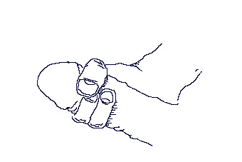

# JAI 拉伸 ~ Johan 的主动隔离拉伸法

---
原作者：**Johan**  
_Sep 8 2002, 6:39AM_
---

我想分享一些关于我如何做 JAI 拉伸的具体信息。

之所以想到这个方法，是因为在刚开始接触阴茎锻炼（PE）的前三个月，我几乎没有任何进展。而这种拉伸方法本来是用在普通肌肉拉伸中的，我就想：为什么不在 PE 中试试呢？

基本内容是每次拉伸持续 2 秒，然后放松 2 秒并重复。为什么要这样呢？因为固有的拉伸反射（即“反弹反射”）会在大约 2 秒的拉伸后启动（尤其是针对 PC 肌）。

因此，基本上我是在有效地拉伸韧带和 PC 肌（这是我的理解）。在每次握力练习后，我都会做三组，每组 15 次的拉伸，以最大限度支持生长。这可能帮助我实现了大部分的增长。

**具体步骤：**

1. 开始深吸气并拉伸你的阴茎（同时我也会收紧腹部）。
2. 保持拉伸并吸气持续 2 秒。
3. 松开拉伸（保持抓握）同时呼气持续 2 秒（腹部放松）。
4. 返回步骤 1。
5. 重复 10 至 15 次，休息约 1 分钟。
6. 重复步骤 1 至 5，共 1 至 4 组。

呼吸能够帮助我掌握节奏（2 秒拉伸 / 2 秒放松）。刚开始的时候，我会看计时器来熟悉节奏，现在这已经成为我的固定习惯了。

关于拉伸力度，不要用尽全力拉伸你的阴茎，这样会触发反弹反射。只需给予一个稳定而适中的拉力即可。

抓握方法：使用基本的“OK 手势”抓握方式抓住阴茎头后部（手掌向上）。同时用中指支撑阴茎以避免对阴茎头施加过多压力。基本上，这种方法可以应用于任何类型的拉伸。我个人偏好在这种标准抓握下进行圆周拉伸。

或者尝试在 [Tom 的网站上](https://penis-enlargement-manual.thundersplace.org/tom-hubbard/2002/AFBconcept.htm) 使用这个握法。

---

**相关链接：**

[JAI Stretch 视频 / 分步教程](https://free-penis-enlargement-videos.thundersplace.org/jai-stretch.html)
