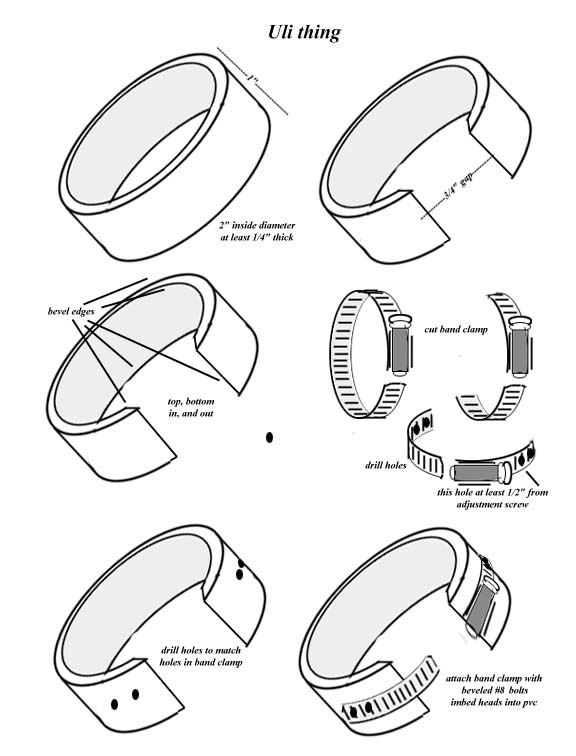

# Bib 的 Uli 工具

## 警告
由于此练习可能产生极大的压力，因此被认为具有较高的风险，未经充分了解阴茎解剖学并且没有数月PE经验的人不应尝试此练习，以确保能够正确评估风险与收益的关系。

## Bib 的 Uli 工具

这里进行的许多练习都非常相似。大多数都涉及在阴茎根部握紧，尽可能多地锁住血液，然后向前推挤，使其流向龟头。

Bib 的 Uli 工具示意图：

我之前写过关于 Uli 的内容。我曾认为它对大多数人来说太危险了，但所有的阴茎锻炼 (PE) 都有一定风险。所以，我会告诉你它是什么。务必小心。

首先，本质上它是一个可调节的、坚固的阴茎环（非弹性），放置在你想要施加压力的部位下方（靠近身体的方向）。这个环大约 1 英寸宽（覆盖阴茎轴的 1 英寸部分）。你需要先用 Thera 或其他保护材料包裹该区域，然后将这个环套在包裹物上。稍微收紧一下，开始勃起。你不需要完全勃起，甚至不需要接近完全勃起。你需要调整这个环，使其完全阻止血液回流，同时不影响血液流入。因此，它会产生巨大的压力。

然后，你可以进一步收紧以彻底切断回流，并进一步增加压力。此外，你还可以抓住这个环，稍微拉动，从而制造更大的压力。

没错，这确实很危险。

关于如何制作我使用的环，并没有简单的描述方法，但这样应该可行：回到五金店 (HD)，告诉店员你需要几英寸的管材，哈哈。确保管材至少有 1/4 英寸厚。

剪下一英寸长的环。倒角处理边缘。然后，沿环的某一处直线切开。让自己完全勃起，并将环放在最粗的部位。接着，剪去一部分环，使其留出大约 3/4 英寸的间隙。

然后，取一个带箍（软管箍），从母端向后剪去约 1 英寸，再从公端剪去约 2 英寸。

在带箍的公端和母端的槽纹上钻几个孔。将母端固定在环的一侧，并钻孔。

公端也做同样的操作，但公端应该超出环的另一侧约 1 英寸。然后用 #8 号螺栓将两端固定到环上。TA DA！

根据以往经验，我敢肯定没人能完全理解我上面写的内容。所以，当我有时间时，我会画出详细的说明，并让 Banshee 发布它们。务必小心，这不适合新手。
