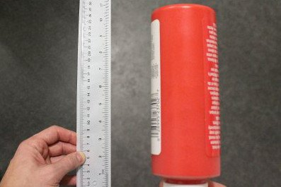
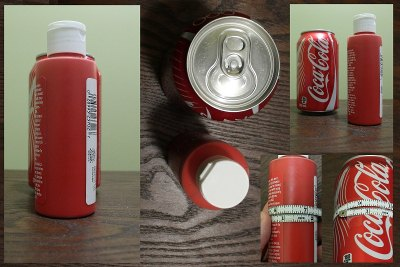
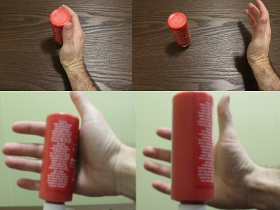
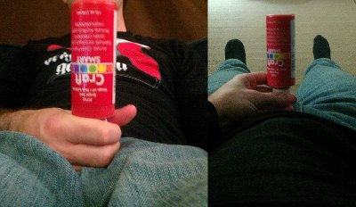
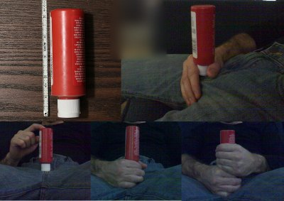
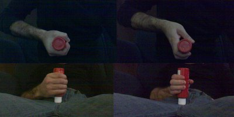
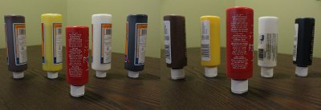
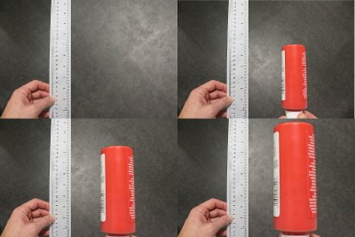

# 如何让你的丁丁看起来更大

摄影技巧可以让阴茎尺寸显得更大

---
原作者：**cantlook**  
__01-15-2014, 10:12 AM__
---

## 一切都取决于角度和摆放方式……

在看到各种不同的照片出现在这里，并且参与了许多关于它们是真是假（或者经过修饰与否）的讨论后，我决定亲自尝试一些摄影技巧，看看这些所谓的“角度”到底能产生多大的影响。然后，我当然想和大家分享这些发现。😉

前几个示例展示了一些完全不需要使用 Photoshop 或任何图像处理的技巧，而最后一个示例则仅需非常基础的图像编辑技能。

## 能还是不能……

受到[某位网友的主张和图片](https://thunders.place/progress-reports-and-pictures/coke-can-covered-by-my-dick.html)启发，我做了这个实验，以展示物体的摆放方式究竟能带来多大的视觉差异。他的主张是许多人的幻想目标——希望自己的粗度能像一罐汽水或啤酒罐那么大。我使用的标准汽水罐周长为 8.25 英寸（一个相当不现实的目标），而我的一管颜料的周长为 5.25 英寸（对于许多人来说，这是一个相对实际的目标）。这两个物体的摆放距离不到半英寸。

## 手中的鸟……

即使[这个帖子中的图片](https://thunders.place/the-dive/fake.html)很明显地显示他的手实际上是处于背景较远的位置，我们的大脑常常会欺骗自己，使前景中的物体看起来比实际更大，特别是当我们看到背景中有较大的物体，或者是我们以为已经知道大小的物体时。这个效果通过广角镜头得到了进一步的夸大，广角镜头能够大大缩小背景物体的外观，并扭曲透视效果。

## 充满谎言的网络……

和其他例子一样，这种类似于网页摄像头的图片越来越常见，因为它通过提供与你的大脑习惯视角相反的视图来极大地扭曲透视效果。你不再是看到躯干、阴茎、腿部……而是看到腿部、阴茎、躯干。这个看似微小的差别，实际上会让大脑对大小产生误解，因为大脑通常会将看到的大小与每天低头时看到的情况相对比。所以，当图像中展示的是一个看起来较大的阴茎与一个看起来较小的躯干（由于透视原因），大脑会认为阴茎比实际看到时要大得多。

## 机会被堆积了……

从下往上看的视角另一个优点是，它利用了阴茎的解剖结构。从上往下看，我们基本上只能看到未被骨骼压迫的长度，而从下往上看，如[这张图片](https://thunders.place/life-love-and-fantasies/pornstar-celebrity-cocks-145.html#post1906531)和[另一张图片](https://thunders.place/the-dive/how-big-is-this.v5-2.html#post2106806)所示，阴囊可以被进一步推下，露出几乎与身体相连的阴茎部分，这部分在性行为中并不可用。然而，通过巧妙放置的手和相机，可以隐藏阴茎根部的实际位置，并让可用的长度留给我们的想象空间。

这支颜料管长约 5 英寸，模拟了 5 英寸的裸露阴茎长度（NBPEL），但我可以用两只手轻松环住它，甚至还有多余空间，通过勾住大拇指并用下方的手推动（在这个演示中是虚拟的）阴囊向下。每一张照片中的瓶子都紧贴着我的身体。

## 抓紧一点……

我的手可以轻松环绕一个 6 英寸的管子，并且不需要用力就能让手指触到一起。我们中的大多数人都会承认，真实的 6 英寸粗度相当大。对我而言，要在手指之间留出 1 英寸的缝隙，我得握住一个大约 7.5 英寸的管子。那么，为什么几乎每张我们在色情片中看到的阴茎被抓住的图片都展示了这个间隙呢？其实这是一个简单的技巧，只要你知道相机的位置，就可以相应地调整手腕。看看视频，你会发现有些情况下手腕的姿势是多么强迫。

## 以小衬大……

让物体看起来更大的另一种常见方法是将其与较小的物体进行对比。在色情视频中，我们经常会看到身材娇小的女性，手小、身体小，甚至有些男演员的体型也较瘦小，这样会让他们的下体显得更大。这种视觉错觉利用了参照物的对比来夸大尺寸。

这两张图片中的红色颜料管实际上是同一根，周长为 5.25 英寸，但通过在背景中放置不同大小的管子，就能在视觉上产生显著的尺寸差异。

## 比例尺的诡计……

这个小技巧是我在[这个帖子](https://thunders.place/progress-reports-and-pictures/introduction-and-my-routine-from-6-to-9-in-1-year.html)中第一次注意到的，它非常巧妙，只需要一把足够长的尺子，基本上就能将图像“一分为二”，再加上最简单的图像编辑软件即可完成。如果你能把尺子完全水平地放在图像中间，就可以利用尺子的边缘作为分界线，轻松地将图像的一半放大（或缩小）。

操作方法很简单——选择一个矩形区域，使其一侧与尺子的边缘对齐，然后将该矩形内的所有内容按比例放大。这种方法之所以有效，是因为大多数“Photoshop 放大”尝试都是直接选择阴茎的轮廓进行放大，这通常会留下明显的编辑痕迹。而这种方法则不会留下那么多破绽。

唯一的问题是，照片必须拍摄在纯色或均匀纹理的地面上。如果背景是带有图案或瓷砖的地面，这种错觉就会被破坏——想象一下，尺子的一侧是正常大小的瓷砖，而另一侧的瓷砖却看起来大了一倍，那就很容易暴露了。

## 镜中物（以及边缘处的物体）比看起来更近

这里还有一个我最近经常看到的技巧，是我在[这个帖子](https://thunders.place/the-dive/this-guys-is-big.html)中注意到的一种视觉效果。

到目前为止，我们大多数人已经在某种程度上习惯了镜头的畸变效应，这种效应通常会放大照片中心的物体。通过将这些中心物体放得更靠近相机，即使使用相对“正常”的镜头，也能创造出相当显著的放大效果。这也是大多数色情视频使用广角镜头、近距离拍摄的原因。

随着我们浏览越来越多的照片，大脑会自动适应并补偿这种常见的畸变效应，因此我们会不自觉地认为，从中心辐射出去的物体会显示得比实际尺寸要小。

为了最大化这一效果，可以巧妙地裁剪原始图像，制造出最放大物体实际上并不处于中心位置的错觉，从而进一步增加它们的感知大小。这么做很简单——裁剪一张更大的图片，让最放大的部分位于图像的边缘而非中心。

附带的图片几乎没有镜头畸变，物体的大小也是可以识别的，但效果依然明显。在裁剪后的照片中，红色颜料管看起来比原始的居中（更宽的）图像大得多。当使用高畸变镜头，或在涉及阴茎尺寸、身体尺寸等未知因素时，这种效果会更加显著。

---

所以，这些就是一些常见视觉错觉的识别技巧。如果你们还有其他类似的例子可以分享，我很乐意看到。我觉得有趣的是，当我们观察普通物体时，可以很清楚地看出尺寸差异，但一旦涉及生殖器，我们的大脑似乎就会以不同的方式处理图像，导致我们更容易受到错觉的影响。

你可以利用这些技巧（尤其是最后一个）来创造一些“激励人心”的照片，或者试着用它们来给某个特别的人留下深刻印象，增添一点乐趣。😉

不过，千万别试图在这里用这些技巧来“惊艳”大家哦！