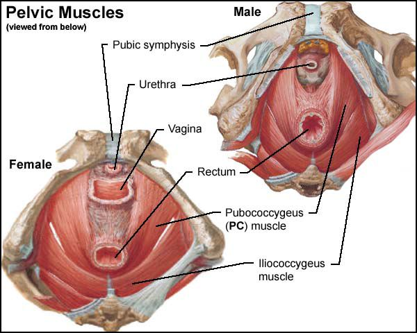
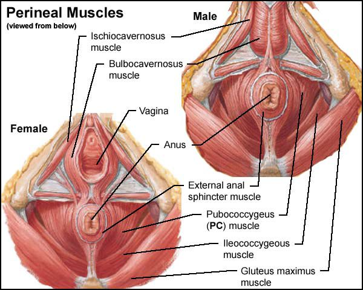
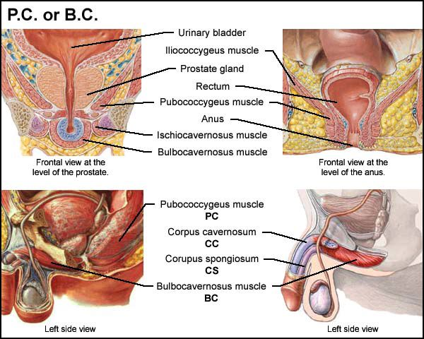

# 定位BC肌肉

---
原作者：**westla90069**  
_Sep 8 2003, 8:14AM_
---

## 定位BC肌肉

我猜，在做凯格尔运动时，叫这块肌肉什么名字可能并不重要，只要你能正确且持续地做这项练习即可。然而，作为一个追求精准的人，我必须指出，男性在做凯格尔运动时所收缩的肌肉与女性是不同的，并且它不是 PC 肌（耻骨尾骨肌，Pubococcygeus）。实际上是 BC 肌（球海绵体肌，Bulbocavernosus）。这可能是互联网上唯一会做出这种区分的地方。大多数人可能会更容易“随波逐流”，并沿用多年来的误解，将其简单地称为 PC 肌。

为什么不是同一块肌肉？因为男性和女性不同。女性基本上是内部性器官，而男性则主要是外部性器官。PC 肌的位置在阴茎的上方和后方，其收缩方向是向骨盆内部。虽然它对肛门的作用可能会略微拉动阴茎，但当男性做凯格尔运动时，这并不是主要参与的肌肉。当然，男性可以收缩他们的 PC 肌。他们每次排便时都会这么做。有些人在做凯格尔运动时可能会（通过涉及肛门区域）收缩它，但这对于增强阴茎的力量来说并不是必须的。

请参考下方的“骨盆肌肉”插图。PC 肌和髂尾骨肌（Iliococcygeus，IC）一起组成了提肛肌（Levator ani muscle），它充当骨盆的“底部”，防止你的腹腔内容物滑向会阴区域。这些肌肉在排便中也起到了一定作用。PC 和 IC 都由两片平滑的肌肉构成（一侧一片）。PC 肌的前部附着在耻骨上，左右两部分沿骨盆两侧向后延展，并在尾骨（尾椎）后部相接。IC 肌也附着于骨盆两侧并延展到尾骨后部，与 PC 类似。从侧面看（此处未展示），提肛肌呈漏斗状，围绕直肠/肛门。其主要作用之一是排便后将直肠复位至正常位置。

请注意，PC 肌呈“U”形，包绕着直肠。女性的尿道和阴道与 PC 肌的接触远比男性的尿道更多。除了在直肠周围形成吊带结构外，PC 肌还沿着阴道和尿道两侧延展并插入其中。将手指放入阴道时，可以感受到该肌肉的收缩。这也是为什么凯格尔医生建议他的女性患者（他是一名妇科医生）锻炼 PC 肌的原因。锻炼这块肌肉有助于收紧阴道管道、直肠和尿道，尤其是在分娩后，这些盆底结构可能因拉伸而松弛，从而导致尿失禁或子宫脱垂。凯格尔医生的研究表明，锻炼 PC 肌可以增强女性的会阴部，不仅能改善身体疾病，还能提升性生活质量。*

那么，球海绵体肌（BC 肌）在哪里？请参阅下方的“会阴肌肉”插图，继续解剖学课程的第二部分。两性都有一对 BC 肌。在女性中，这些肌肉环绕着阴道开口。有些女性可以独立收缩 BC 肌和 PC 肌，大多数人同时收缩两者。而在男性中，BC 肌的两部分以“鱼骨”图案结合在一起，环绕着阴茎球（海绵体内基底部分）。

BC 肌有两个主要功能。其一是通过挤压液体（如尿液或精液）将其从尿道中排出。这是通过肌肉纤维的“鱼骨”交错排列实现的，这些纤维在收缩时会将尿液或精液“挤压”向尿道口（即龟头顶端的开口）。这项功能还会使阴茎被拉入体内（即所谓的 LOT 回拉效应）。男性每次小便时都会发生这种现象。在射精时，这种现象的力道更大且伴随有节奏的收缩。BC 肌是推动精液排出的主要肌肉，这也是为什么锻炼 BC 肌可以改善射精功能的原因。

BC 肌的另一个功能是将血液压入尿道海绵体和龟头中。阴茎球部是一个血液储存库。在性唤起的顶峰时，BC 肌和坐骨海绵体肌（Ischiocavernosus muscle）的自愿或反射性收缩会将血液压入阴茎的海绵体部分。坐骨海绵体肌包绕着阴茎的两条脚部（海绵体的两腿）。当这两组肌肉同时收缩作用于阴茎的基部和脚部时，就可以实现最硬的勃起状态。

如何定位 BC 肌：通过“停止尿流”的方式来定位男性的 BC 肌是一个有效方法。尽管尿道确实存在一个括约肌（位于前列腺下方）来停止尿流，BC 肌的收缩会“挤压”尿道，并让男性感受到哪块肌肉需要用于练习凯格尔运动。同时，可以用手指触摸会阴部，即阴囊与肛门之间的区域（中线位置）。如果在该点通过皮肤感受到肌肉的收缩，这些收缩来自于 BC 肌。插图 “P.C. 或 B.C.” 展示了男性 PC 肌与前列腺的关系及其在直肠周围的分布（上两幅图），同时也展示了 BC 肌在阴茎基部的位置（下两幅图）。

在互联网上搜索男性如何练习凯格尔运动的相关指南，您会发现五花八门的计划。一些指南建议，从每天两次、每次20次开始，并在六周内逐步增加到每天100次。另一些网站则建议每天练习多达300次，每次收缩保持几秒钟，而且要“坚持一辈子”。事实上，没有统一的答案。每位男性都需要根据自身情况进行评估，并相应调整锻炼计划。

一种较为合理的计划是：从少量的快速收缩开始，逐步增加到每天一百次，每次保持收缩几秒钟。这是一个不错的起点。一周练习几天就足够用来评估您的情况。如果您没有注意到射精力度或勃起强度的变化，那么可能需要更多地锻炼 BC 肌，而非 PC 肌。

---

\* 以下是凯格尔发表的[原始文章](https://www.gyneflex.com/kegel_article.html)，供有兴趣者参考。
  